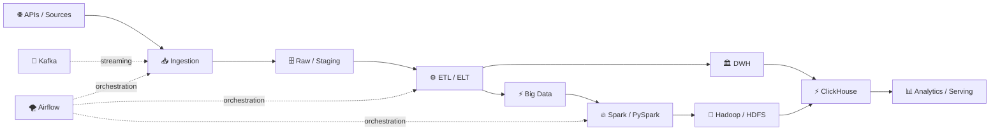

<h1 align="center">👋 Hi, I'm Evgeniy</h1>

<p align="center">
  <a href="https://git.io/typing-svg">
    
  </a>
</p>

<p align="center">
  <b>ITMO University · Data Engineering · Big Data</b>
</p>

<p align="center">
  <a href="mailto:zma54211@gmail.com">📧 Email</a>
  &nbsp;•&nbsp;
  <a href="https://github.com/1nf6ct6d">🐙 GitHub</a>
</p>

---

```text
evgeniy@itmo:~/data-engineering$ whoami

ROLE        → Data Engineer
FOCUS       → ETL / ELT · DWH · Big Data · Data Pipelines
STACK       → Python · SQL · Airflow · ClickHouse · Spark · Hadoop
EDUCATION   → ITMO University · Cybersecurity
STATUS      → OPEN TO INTERNSHIP
```

> [!IMPORTANT]
> 🟢 **Open to Data Engineering internship opportunities / Открыт к предложениям на стажировку Data Engineer**

---

## 👨‍💻 About Me / Обо мне

| 🇬🇧 English | 🇷🇺 Русский |
|---|---|
| 🎯 Looking for a **Data Engineering internship** | 🎯 Ищу стажировку в направлении **Data Engineering** |
| 🎓 **ITMO University** — Faculty of Cybersecurity | 🎓 **ИТМО** — факультет кибербезопасности |
| 🌍 Russia | 🌍 Россия |
| 🔥 **Winner & Finalist — Russian IT CUP 2026** | 🔥 **Победитель и финалист первого тура Russian IT CUP 2026** |

---

## 🏆 Highlights

### 🏆 Russian IT CUP 2026
**Winner & Finalist / Победитель и финалист**

### 🎓 ITMO University
**Faculty of Cybersecurity / Факультет кибербезопасности**

### ⚙️ Engineering Focus
**Data Engineering · Big Data · DWH · ETL/ELT · Data Pipelines**

---

## 🛠 Tech Stack

### 🐍 Languages & Data Processing

<kbd>Python</kbd>
<kbd>SQL</kbd>
<kbd>Pandas</kbd>
<kbd>JSON</kbd>
<kbd>CSV</kbd>

### ⚙️ Data Engineering

<kbd>ETL / ELT</kbd>
<kbd>Apache Airflow</kbd>
<kbd>Data Pipelines</kbd>
<kbd>Data Modeling</kbd>
<kbd>API Ingestion</kbd>
<kbd>Data Warehousing</kbd>

### ⚡ Big Data

<kbd>Apache Spark</kbd>
<kbd>PySpark</kbd>
<kbd>Apache Hadoop</kbd>
<kbd>HDFS</kbd>
<kbd>Apache Kafka</kbd>
<kbd>Big Data Processing</kbd>

### 🗄 Databases & Storage

<kbd>PostgreSQL</kbd>
<kbd>Oracle DWH</kbd>
<kbd>ClickHouse</kbd>
<kbd>MinIO</kbd>

### 🐳 Backend & Infrastructure

<kbd>FastAPI</kbd>
<kbd>Docker</kbd>
<kbd>Linux</kbd>
<kbd>Bash</kbd>
<kbd>Git</kbd>
<kbd>GitHub Actions</kbd>
<kbd>REST API</kbd>

---

## ⚙️ Data Engineering Workflow



<p align="center">
  <b>Ingest → Store → Transform → Process → Model → Serve → Analyze</b>
</p>

---

# 🚀 Featured Projects

## 🟡 F1 DATA WAREHOUSE ANALYTICS SYSTEM

**End-to-End Data Engineering · DWH · Analytics**

<kbd>Python</kbd>
<kbd>ETL</kbd>
<kbd>Oracle DWH</kbd>
<kbd>ClickHouse</kbd>
<kbd>Airflow</kbd>
<kbd>MinIO</kbd>
<kbd>FastAPI</kbd>

🔗 **Repository:**  
https://github.com/1nf6ct6d/F1-Data-Warehouse-Analytics-System

**RU:** End-to-end Data Engineering проект: API ingestion → raw/staging в MinIO → dimensions и facts в Oracle DWH → analytics views → serving-слой в ClickHouse → оркестрация через Airflow → FastAPI.

```text
Public API
    ↓
Raw / Staging
    ↓
MinIO
    ↓
Oracle DWH
Dimensions + Facts
    ↓
Analytics Views
    ↓
ClickHouse
    ↓
FastAPI / Analytics
```

---

## 🟡 CUPIT 2026 — AI SEARCH ANALYSIS FOR FMCG BRANDS

**Data Engineering · API Ingestion · Analytics**

<kbd>Python</kbd>
<kbd>ETL</kbd>
<kbd>API</kbd>
<kbd>PostgreSQL</kbd>
<kbd>SQL</kbd>
<kbd>Pandas</kbd>

🔗 **Repository:**  
https://github.com/1nf6ct6d/CupIT2026-Data-Engineering-AI-Search-Analysis-for-FMCG-Brands

**RU:** Data pipeline для анализа AI Search: сбор данных через API → обработка и нормализация ответов → извлечение источников и упоминаний брендов → PostgreSQL → SQL-анализ.

```text
Search API
    ↓
Data Collection
    ↓
Normalization
    ↓
Brand / Source Extraction
    ↓
PostgreSQL
    ↓
SQL Analytics
```

---

## 🟡 ALPHACUP 2026

**Multi-Source Data Pipeline · NLP**

<kbd>Python</kbd>
<kbd>ETL</kbd>
<kbd>YouTube</kbd>
<kbd>VK</kbd>
<kbd>Telegram</kbd>
<kbd>NLP</kbd>

🔗 **Repository:**  
https://github.com/1nf6ct6d/AlphaCup2026

**RU:** Multi-source data pipeline для сбора пользовательских комментариев из YouTube, VK и Telegram: ingestion → унификация → дедупликация → обработка текста → анализ пользовательских проблем.

```text
YouTube ─┐
VK      ─┼─→ Ingestion → Normalize → Deduplicate → NLP → Analytics
Telegram ─┘
```

---

## 🟡 OZONTECH ROBOZON SORTING SYSTEM

**Engineering · Computer Vision · Data Pipeline**

<kbd>Python</kbd>
<kbd>FastAPI</kbd>
<kbd>YOLO</kbd>
<kbd>Blender</kbd>
<kbd>PyBullet</kbd>
<kbd>Docker</kbd>

🔗 **Repository:**  
https://github.com/1nf6ct6d/OzonTech-Robozon-sorting-system

**RU:** Инженерная система автоматической сортировки товаров: обработка изображений → CV pipeline на YOLO → генерация synthetic datasets в Blender → FastAPI backend → симуляция сортировочной линии.

```text
Product Data
    ↓
Synthetic Dataset
    ↓
Blender
    ↓
YOLO
    ↓
Classification
    ↓
FastAPI
    ↓
Sorting Simulation
```

---

# 📂 More Projects

<details>
<summary><b>🟡 CENTRALIZED DRIVING SCHOOL DATABASE</b></summary>

<br>

<kbd>Python</kbd>
<kbd>SQL</kbd>
<kbd>Database</kbd>
<kbd>Backend</kbd>

🔗 https://github.com/1nf6ct6d/CENTRALIZED_DRIVING_SCHOOL_DATABASE

**RU:** Централизованная система хранения и обработки данных автошкол с использованием Python и SQL.

</details>

<br>

<details>
<summary><b>🟡 API-TO-CSV-CONVERTER</b></summary>

<br>

<kbd>Python</kbd>
<kbd>API Ingestion</kbd>
<kbd>JSON</kbd>
<kbd>ETL</kbd>
<kbd>CSV</kbd>

🔗 https://github.com/1nf6ct6d/API-TO-CSV-CONVERTER

**RU:** Простой ETL pipeline: публичный API → raw JSON → transformation → структурированный CSV.

</details>

<br>

<details>
<summary><b>🟡 YAHOO FINANCE EXTRACTOR</b></summary>

<br>

<kbd>Python</kbd>
<kbd>API</kbd>
<kbd>Data Extraction</kbd>
<kbd>Automation</kbd>

🔗 https://github.com/1nf6ct6d/YAHOO-FINANCE-TRACKER

**RU:** Автоматизированный pipeline для извлечения и обработки финансовых данных из Yahoo Finance.

</details>

---

## 🎯 Current Focus

```yaml
data_engineering:
  - ETL / ELT
  - Data Warehousing
  - Data Modeling
  - Apache Airflow
  - ClickHouse

big_data:
  - Apache Spark
  - PySpark
  - Hadoop
  - HDFS
  - Kafka

building:
  - Batch Data Pipelines
  - API Ingestion
  - DWH Systems
  - Analytics Platforms

career:
  target: Data Engineer Intern
  status: open_to_opportunities
```

---

## 📫 Contacts

📧 **Email:** [zma54211@gmail.com](mailto:zma54211@gmail.com)  
🐙 **GitHub:** [github.com/1nf6ct6d](https://github.com/1nf6ct6d)

---

<p align="center">
  <b>Data is only useful when you can move it, model it and trust it.</b>
</p>

<p align="center">
  <code>ingest() → transform() → process() → model() → serve()</code>
</p>
