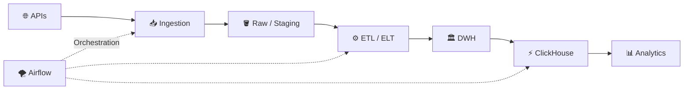

<h1 align="center">👋 Hi, I'm Evgeniy</h1>

  

  
  

---

## 👨‍💻 About Me / Обо мне

| 🇬🇧 English | 🇷🇺 Русский |
|---|---|
| 🎯 Looking for a **Data Engineering internship** | 🎯 Ищу стажировку в направлении **Data Engineering** |
| 🎓 **ITMO University** — Faculty of Cybersecurity | 🎓 **ИТМО** — факультет кибербезопасности |
| 🌍 Russia | 🌍 Россия |
| 🔥 **Winner & Finalist — Russian IT CUP 2026** | 🔥 **Победитель и финалист первого тура Russian IT CUP 2026** |

> [!IMPORTANT]
> 🟢 **Open to Data Engineering internship opportunities / Открыт к предложениям на стажировку Data Engineer**

---

## 🛠 Tech Stack

  

  
  
  
  
  

  
  
  
  
  

---

## ⚙️ How I Think About Data

  <b>Ingest → Store → Transform → Model → Serve → Analyze</b>

---

# 🚀 Featured Projects

  
  

  
  

---

### 🟡 F1 DATA WAREHOUSE ANALYTICS SYSTEM

**Python | Data Engineering | ETL | Oracle DWH | ClickHouse | Airflow | MinIO | FastAPI**

➡️ https://github.com/1nf6ct6d/F1-Data-Warehouse-Analytics-System

**About / О проекте:**

RU: End-to-end Data Engineering проект: API ingestion → raw/staging в MinIO → dimensions и facts в Oracle DWH → analytics views → serving-слой в ClickHouse → оркестрация через Airflow → FastAPI.

---

### 🟡 CUPIT 2026 — AI SEARCH ANALYSIS FOR FMCG BRANDS

**Python | Data Engineering | ETL | API | PostgreSQL | SQL | Pandas | Analytics**

➡️ https://github.com/1nf6ct6d/CupIT2026-Data-Engineering-AI-Search-Analysis-for-FMCG-Brands

**About / О проекте:**

RU: Data pipeline для анализа AI Search: сбор данных через API, обработка и нормализация ответов, извлечение источников и упоминаний брендов, загрузка структурированных данных в PostgreSQL и SQL-анализ.

---

### 🟡 ALPHACUP 2026

**Python | Data Engineering | ETL | API Ingestion | YouTube | VK | Telegram | NLP**

➡️ https://github.com/1nf6ct6d/AlphaCup2026

**About / О проекте:**

RU: Multi-source data pipeline для сбора комментариев из YouTube, VK и Telegram: ingestion → нормализация → дедупликация → обработка текста → анализ пользовательских проблем.

---

### 🟡 OZONTECH ROBOZON SORTING SYSTEM

**Python | Data Pipeline | FastAPI | Computer Vision | YOLO | Blender | PyBullet | Docker**

➡️ https://github.com/1nf6ct6d/OzonTech-Robozon-sorting-system

**About / О проекте:**

RU: Инженерная система автоматической сортировки товаров: обработка данных и изображений, CV pipeline на YOLO, генерация synthetic datasets в Blender, FastAPI backend и симуляция сортировочной линии.

---

## 📂 More Projects

### 🟡 CENTRALIZED DRIVING SCHOOL DATABASE

**Python | SQL | Database | Backend**

➡️ https://github.com/1nf6ct6d/CENTRALIZED_DRIVING_SCHOOL_DATABASE

**About / О проекте:**

RU: Централизованная система хранения и обработки данных автошкол с использованием Python и SQL.

---

### 🟡 API-TO-CSV-CONVERTER

**Python | Data Engineering | API Ingestion | JSON | ETL | CSV**

➡️ https://github.com/1nf6ct6d/API-TO-CSV-CONVERTER

**About / О проекте:**

RU: Простой ETL pipeline: получает данные из публичного API, сохраняет raw JSON, преобразует данные и экспортирует структурированный CSV.

---

### 🟡 YAHOO FINANCE EXTRACTOR

**Python | Data Engineering | API | Data Extraction | Automation**

➡️ https://github.com/1nf6ct6d/YAHOO-FINANCE-TRACKER

**About / О проекте:**

RU: Автоматизированный pipeline для извлечения и обработки финансовых данных из Yahoo Finance.

---

## 📊 GitHub Stats

  
  

---

## 📈 Contribution Activity

  

---

## 🐍 Contributions

  <picture>
    <source
      media="(prefers-color-scheme: dark)"
      srcset="https://raw.githubusercontent.com/1nf6ct6d/1nf6ct6d/output/github-contribution-grid-snake-dark.svg"
    />
    <source
      media="(prefers-color-scheme: light)"
      srcset="https://raw.githubusercontent.com/1nf6ct6d/1nf6ct6d/output/github-contribution-grid-snake.svg"
    />
    
  </picture>

---

  <b>⭐ Focus on quality. Automation mindset. Continuous learning.</b>

  <code>while True: learn() → build() → improve()</code>

